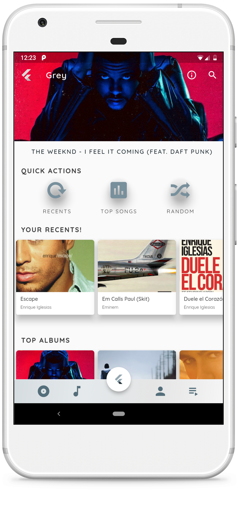
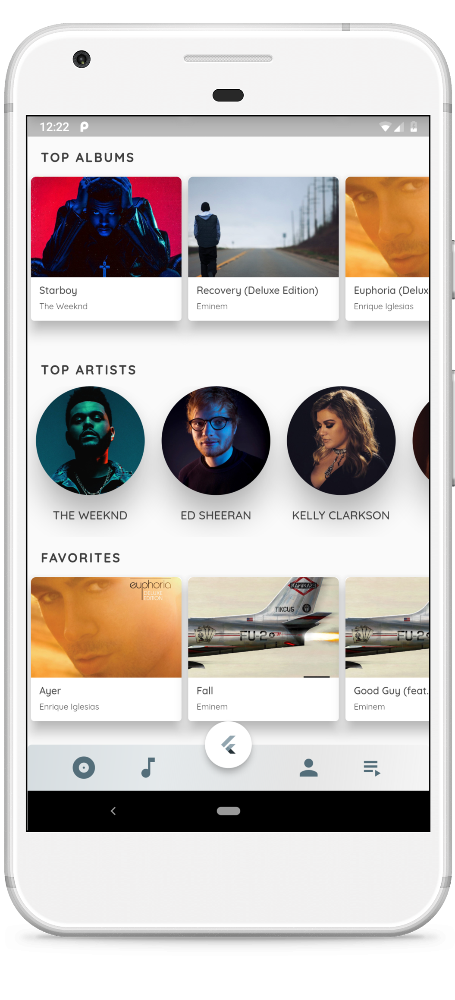
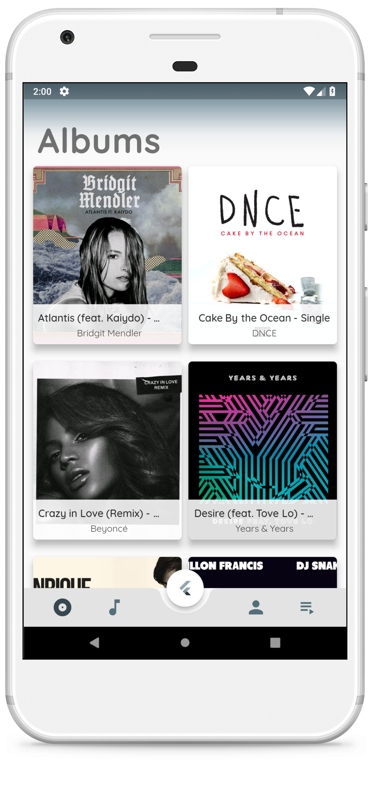
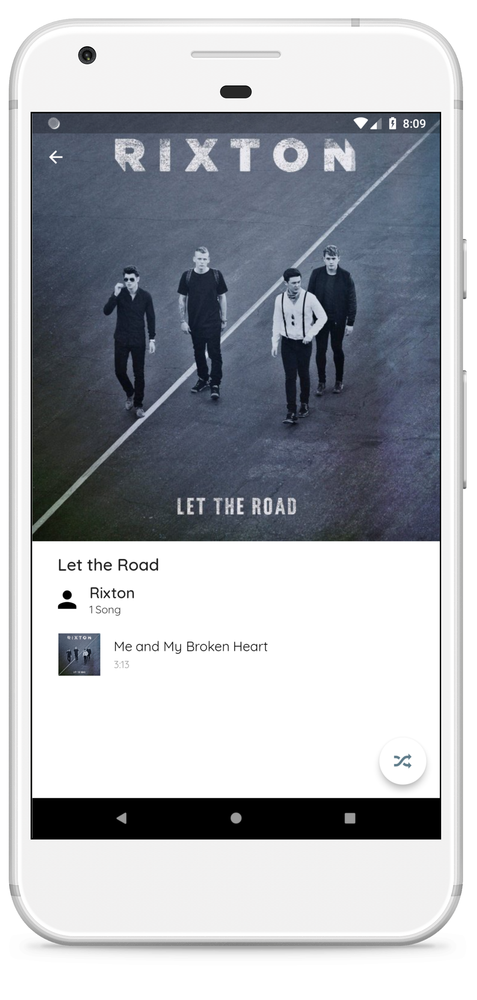
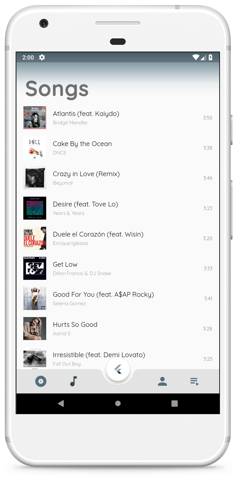
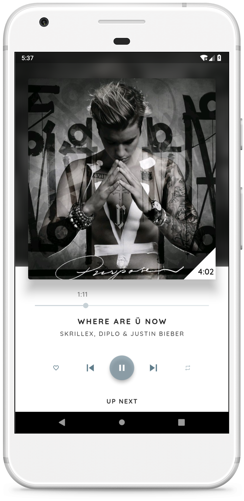
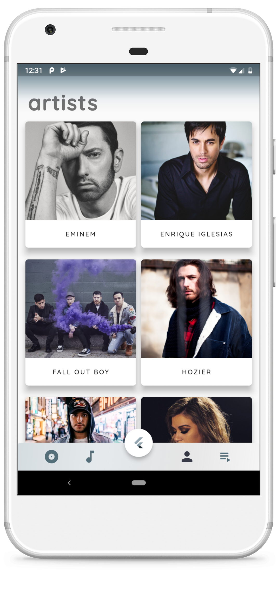
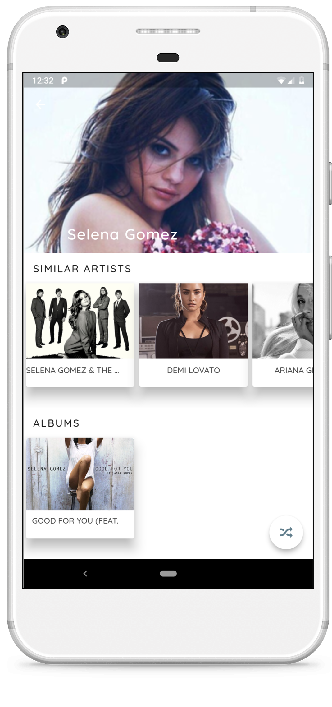
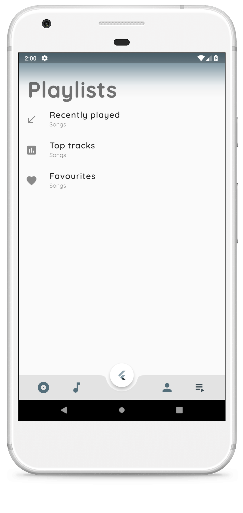

# Music Player

A Material designed music player developed in Flutter

# Screenshots

# Plugins
Music player plugin used : <a href="https://github.com/iampawan/Flute-Music-Player">Flute-music</a>

